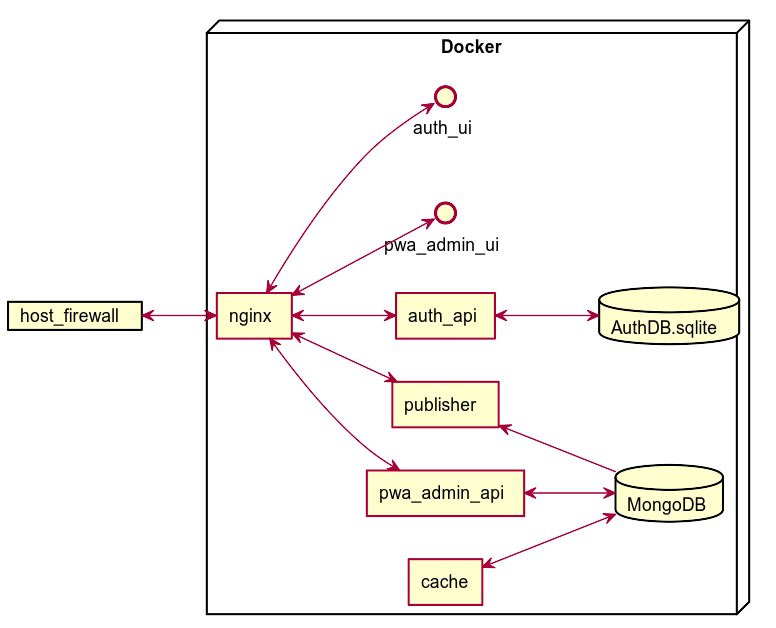

# PWA Development
## pSConfig Web Administrator

## Tech stack
 * MEAN (MongoDB, Express, Angular, NodeJS)
 * Uses Mongoose, a sort of ORM for Mongo, for modeling object schemas and connecting/querying the Mongo database.

## Building

See separate documentation in [BUILDING.md](BUILDING.md)

## Development environment

Add how to set up a dev environment here.

## Architecture
### Architecture Diagram

pSConfig Web-based administration GUI and tools to publish configs in pSConfig/MeshConfig formats.

Documentation for PWA can be found on the main perfSONAR documentation site:

* [pSConfig Web Admin documentation](http://docs.perfsonar.net/pwa.html)

